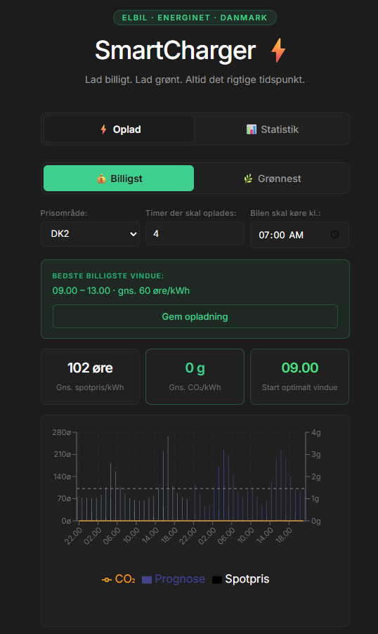
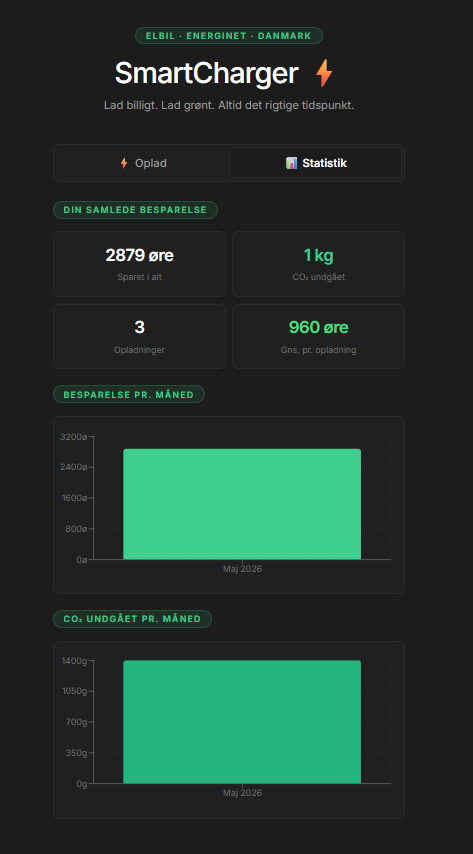

# ⚡ SmartCharger

> **Lad billigt. Lad grønt. Altid det rigtige tidspunkt.**

SmartCharger er en dansk web-app der hjælper elbilsejere med at lade deres bil på det **billigste** og **grønneste** tidspunkt — baseret på live spotpriser og CO₂-data fra [Energinet](https://www.energidataservice.dk/).

---

## 📸 Screenshots

| Oplad | Statistik |
|-------|-----------|
|  |  |

---

## ✨ Features

- **Live elpriser** — Henter spotpriser time for time fra Energinet (DK1 + DK2)
- **CO₂-optimering** — Vælg mellem *Billigst* eller *Grønnest* strategi
- **Smart ladevindue** — Finder det bedste sammenhængende tidsvindue inden din deadline
- **ML-prisfremskrivning** — Forudsiger næste 24 timers priser med SSA (Singular Spectrum Analysis)
- **Historik & besparelser** — Gem dine opladninger og se hvad du har sparet
- **Månedlig CO₂-rapport** — Del din grønne profil på LinkedIn
- **DK1 & DK2** — Understøtter begge danske prisområder

---

## 🏗️ Arkitektur

Projektet følger **Clean Architecture** med fuld SOLID-overholdelse:

```
SmartCharger.Domain          → Ren domænelogik, ingen afhængigheder
  └── Models/                → ElspotPrice, HourData, ChargeWindow, ChargeSession...
  └── Logic/ChargingOptimizer→ Ren algoritme — testbar og HTTP-fri

SmartCharger.Application     → Business-logik, afhænger kun af Domain
  └── Interfaces/            → IElspotRepository, ISessionRepository,
                               IChargingService, IForecastService, ISessionService
  └── Services/              → ChargingService, SessionService, ForecastService

SmartCharger.Infrastructure  → Teknisk implementering
  └── Repositories/          → EnergidataRepository (HTTP + cache + backoff)
                               SqliteSessionRepository (EF Core)
  └── Persistence/           → AppDbContext (SQLite)

SmartCharger.Api             → HTTP-lag, ingen business-logik
  └── Program.cs             → DI-registrering + Minimal API endpoints

frontend/                    → React + Vite + TypeScript
  └── App.tsx                → MVVM-inspireret komponentarkitektur
  └── StatisticsPage.tsx     → Månedlig statistik og CO₂-rapport
```

### Tech Stack

| Lag | Teknologi |
|-----|-----------|
| Backend | .NET 8 Minimal APIs |
| Database | SQLite med EF Core 8 |
| ML | ML.NET 3 (SSA Time Series) |
| Resilience | Polly (retry + timeout) |
| Frontend | React 19 + Vite + TypeScript |
| State | TanStack Query v5 |
| Grafer | Recharts |
| CI/CD | GitHub Actions |
| Container | Docker + Docker Compose |

---

## 🚀 Kom i gang

### Forudsætninger

- [.NET 8 SDK](https://dotnet.microsoft.com/download/dotnet/8.0)
- [Node.js 20+](https://nodejs.org/)
- [Docker](https://www.docker.com/) (valgfrit)

### Start lokalt

```bash
# Terminal 1 — Backend API
cd SmartCharger
dotnet run --project src/SmartCharger.Api --launch-profile http

# Terminal 2 — Frontend
cd frontend
npm install
npm run dev
```

Åbn `http://localhost:5173` i din browser.

### Med Docker Compose

```bash
docker compose up
```

Åbn `http://localhost:3000`.

---

## 🧪 Tests

```bash
dotnet test --configuration Release --verbosity normal
```

8 unit tests med **FluentAssertions** dækker:
- Billigste sammenhængende ladevindue
- Grønneste ladevindue (CO₂-optimeret)
- Deadline-håndtering
- Negative elpriser
- Edge cases (tom liste, for få timer)

---

## 📡 API Endpoints

| Method | Endpoint | Beskrivelse |
|--------|----------|-------------|
| GET | `/api/elspot/merged` | Spotpriser + CO₂ merged |
| GET | `/api/elspot/recommendations` | Anbefalede ladetimer |
| GET | `/api/elspot/window` | Bedste ladevindue |
| GET | `/api/elspot/forecast` | ML-prisfremskrivning (24t) |
| POST | `/api/sessions` | Gem en opladning |
| GET | `/api/sessions/stats` | Samlet besparelse |
| GET | `/api/sessions/monthly` | Månedlig statistik |
| GET | `/api/sessions/co2report` | CO₂-rapport med LinkedIn-deling |

Swagger UI: `http://localhost:5000/swagger`

---

## 🌍 Datasources

- **Spotpriser**: [Energinet Elspotprices](https://www.energidataservice.dk/tso-electricity/Elspotprices) — gratis, ingen auth
- **CO₂-prognose**: [Energinet CO2Emis](https://www.energidataservice.dk/tso-electricity/CO2Emis) — gratis, ingen auth

---

## 📁 Projektstruktur

```
SmartCharger/
├── src/
│   ├── SmartCharger.Api/
│   ├── SmartCharger.Application/
│   ├── SmartCharger.Domain/
│   └── SmartCharger.Infrastructure/
├── tests/
│   └── SmartCharger.Tests/
├── frontend/
│   └── src/
├── docker-compose.yml
└── README.md
```

---

## 👤 Udvikler

Bygget med ❤️ og [Claude](https://claude.ai) som AI-pair programmer.

[](https://github.com/oumar969/SmartCharger/actions)
